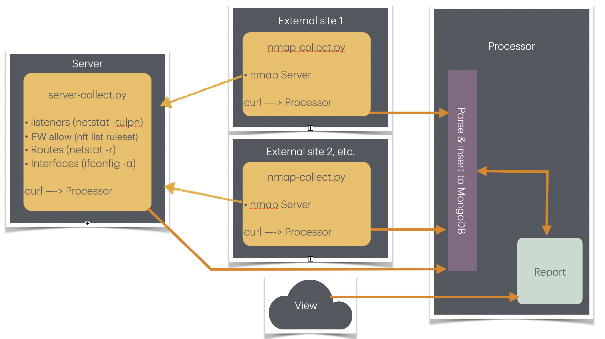
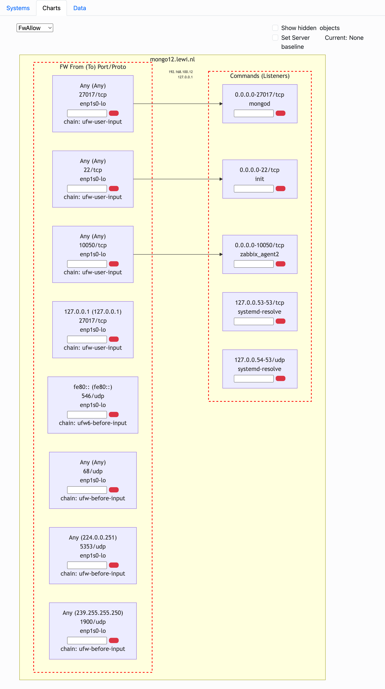
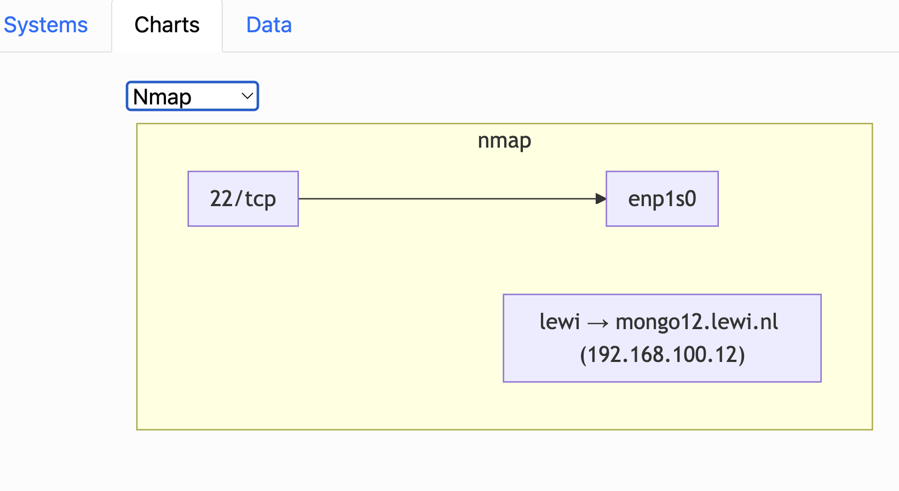
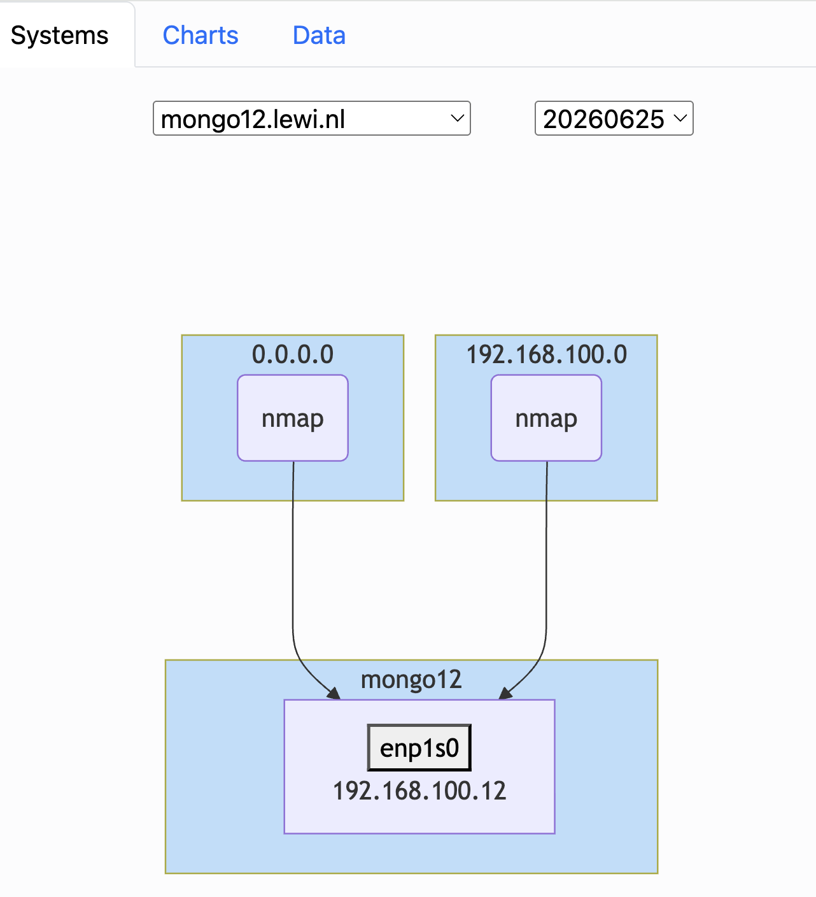

# nchecknet

Cross-reference your nftables firewall rules against active listeners, routing table, network interfaces, and external nmap scans — and surface the discrepancies.






---

## Features

- Compares `nftables` rules against `netstat -ntlp`, `netstat -rn`, and `ifconfig`
- Runs nmap from external vantage points and flags ports open to the world without a matching firewall rule
- Daily cron-based collection; annotations and suppression flags carry over between sessions
- Baseline comparison — alerts when listeners, firewall rules, routes, or interfaces appear or disappear
- Nmap alerts — flags ports found open externally with no matching firewall rule, stored per session
- Web UI with interactive Mermaid diagrams, inline comments, and per-rule suppression

---

## Requirements

- Go (to build)
- MongoDB
- net-tools
- nmap (on the external scanning hosts)
- Root access on monitored servers (for the collection scripts)

---

## Build

```sh
cd v2
go mod tidy
make
```

Produces `bin/webserver`, `bin/collector`, and `bin/utils`.

---

## Configuration

Place `nchecknet.yml` in `etc/` or `/usr/local/etc/`:

```yaml
webserver:
  jwtsecret: "a long random secret"
  port: "8086"
  mongodburl: "mongodb://..."
  maxsessionidselect: 3        # number of recent sessions shown in the UI
  webroot: "/path/to/webroot"

collector:
  collectorurl: "https://your-collector-fqdn"
  port: "8087"
```

---

## Quick Start

**1. Create a user and register a server:**

```sh
bin/utils -nu john -O JohnOrg -P johnpass -R a
bin/utils -ns server.john.org -O JohnOrg
```

**2. Start the services:**

```sh
bin/collector &
bin/webserver &
```

**3. Deploy the collector script to the monitored server:**

```sh
bin/utils -cs server.john.org > collector-script
chmod 755 collector-script
scp collector-script server.john.org:
ssh server.john.org sudo ./collector-script
```

**4. Generate and deploy an nmap script from an external vantage point:**

```sh
# Replace 20260612 with today's date (YYYYMMDD)
bin/utils -nm -i 20260612 -if eth0 -s server.john.org > nmap-script
chmod 755 nmap-script
scp nmap-script somehost:
ssh somehost sudo ./nmap-script
```

**5. Schedule both scripts to run daily:**

```sh
cp collector-script /etc/cron.daily/
cp nmap-script /etc/cron.daily/      # on the external host
```

Generate nmap scripts for additional interfaces from the **Systems** tab of the web UI.

---

## Usage

### `bin/webserver`

Serves the web UI at the configured port (default `8086`). Login, browse sessions, and view interactive charts comparing firewall rules, listeners, and nmap scan results.

### `bin/collector`

Receives telemetry POSTed by the collector and nmap scripts (default port `8087`). No user authentication — security is by the per-server key embedded in the generated scripts.

### `bin/utils`

CLI for administration and script generation. All flags:

| Flag | Description |
|---|---|
| `-nu <username>` | Create a user; requires `-P`, `-O`, `-R` |
| `-ns <fqdn>` | Register a new server; requires `-O` |
| `-cs <fqdn>` | Print the collector script for a server to stdout |
| `-nm` | Print the nmap script; requires `-i <date>`, `-if <iface>`, `-s <fqdn>`, `-cl <url>` |
| `-sb <hostname>` | Set baseline session; requires `-i <sessionid>` |
| `-r` | Print a JSON report for a host/session |
| `-i2 <sid>` | Compare two sessions; use with `-i <sid1>` and `-s <fqdn>` |
| `-pp <Struct:HN:SID>` | Pretty-print stored server data |
| `-O <owner>` | Owner |
| `-P <password>` | Password |
| `-R <rights>` | Rights: `a`, `w`, or `r` |
| `-s <fqdn>` | Server FQDN |
| `-i <ident>` | Session ID (YYYYMMDD) |
| `-if <iface>` | Interface name |
| `-cl <url>` | Collector URL |

---

## Access Rights

| Symbol | Description |
|---|---|
| `a` | Admin — sees all servers across all owners; full write access |
| `w` | Write — sees own owner's servers; can suppress rules and edit comments |
| `r` | Read-only — sees own owner's servers |

---

## Baseline

If a baseline is set for a server, incoming data is compared against that baseline session. Any item that appeared or disappeared is both logged by the collector and persisted to the `ServerAlerts` MongoDB collection.

```
2026-06-27T13:36:37.841641+02:00 monitor collector[2884]: Listener disappeared: someserver {v4 tcp 0.0.0.0 33443 0.0.0.0  comment false}
```

---

## Nmap Alerts

When `CompareFromNMAPViewpoint` finds a port open externally that has no matching firewall rule, it logs the finding and persists it to the `NmapAlerts` MongoDB collection.

---

## Architecture

```
Monitored servers (cron daily)
┌───────────────────────────┐
│  collector-script         │  POST /api_server
│  ifconfig, netstat, nft   ├──────────────────────┐
└───────────────────────────┘                       │
                                                    ▼
External vantage points (cron daily)       ┌────────────────┐
┌───────────────────────────┐              │   collector    │
│  nmap-script              │  POST /api_nmap  (port 8087)  │
│  nmap -Pn <server IPs>    ├─────────────►│                │
└───────────────────────────┘              └───────┬────────┘
                                                   │
                                           ┌───────▼────────┐
                                           │    MongoDB     │
                                           └───────┬────────┘
                                                   │
Browser ◄──── WebSocket (JWT) ───────────┌────────▼────────┐
(Bootstrap + Mermaid.js)                 │   webserver    │
                                         │  (port 8086)   │
                                         └────────────────┘
```

See [architecture.md](architecture.md) for full detail on data model, data flow, and component internals.
